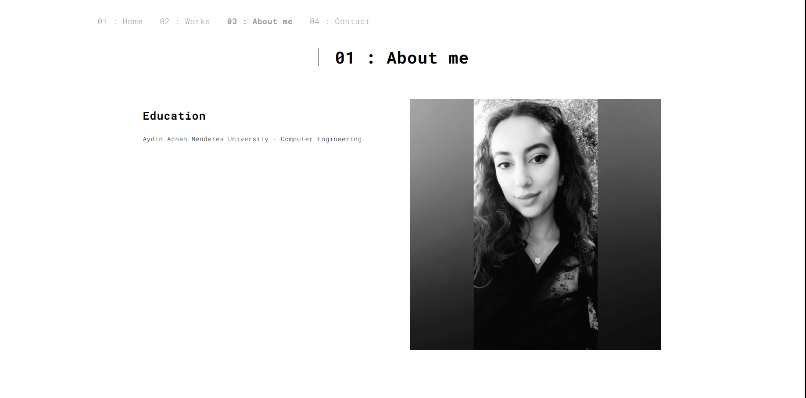

# My Blog Sites With Django





This project is a statically running blog site that I created to learn Django. I took the interface of the project from the website (https://www.free-css.com/) and arranged it according to my needs. There is a configuration file (env) in the project.

# USAGE 

```bash
# Create env
$ python -m venv env

# Install Django
$ pip install Django

# Activate env
$ env\Scripts\activate

# Install libraries
$ cd berfinblog_con
$ pip install -r requirements.txt

# Run it
$ python manage.py runserver

# Go to 8000 server
$ http://localhost:8000/
```


